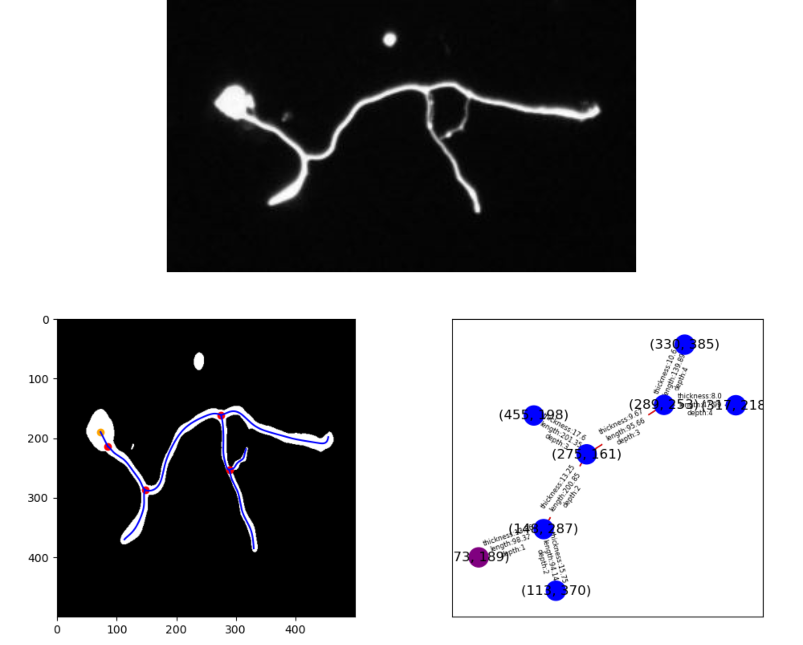

# Neural Branch Detection Method



This project involves developing a method for understanding neural structure from noisy images. The ultimate goal is to represent a neuron as a tree-like data structure, where the root is the neuron nucleus, with branches weighted by thickness, length and depth. We can then identify the longest branch whose properties are of interest for neuro-medical research.

## Usage
```
python main.py
```

## Requirements
```
Python
OpenCV
Matplotlib
Numpy
Scipy
NetworkX
```
## Classes and Files:

`skeleton.py`: The `Skeleton` class is designed to represent the skeleton of a binary image and allow processing on it.

- `__init__` takes a binary image matrix and an instance of the `Soma` class as arguments, then initializes the various attributes of the object.

- `plot()` displays the skeleton points in a Matplotlib window.

- `simplify()` simplifies the skeleton lines to avoid having an excess of points in some areas, which can sometimes cause branching points to have four neighbors.

- `get_neighbors()` retrieves the neighbors of a given point in an adjacent cell, which are not diagonal if the `excludeDiag` option is set to `True` and are not in the exclusion list `excludeThose`.

- `get_branching_points()` detects the branching points of the skeleton, meaning the points where a branch splits into two. This method scans all the points of the skeleton.

`Branch.py`: The `Branch` class represents a branch of the skeleton.

- `is_branching_out()`: returns True if the last point of the branch is a branching point of the skeleton.

- `relier_centre()` takes the coordinates of the center as input and draws a straight line segment between the first point of the branch and the center on the skeleton map.

- `least_square_approximation()` calculates an approximation function of the branch points using a least squares method.

- `plot_approximation()` calculates the points of the parametric curve of the polynomial approximation with a discretization of [0,1] and the coefficients of the function. Displays the curve.

- `measure_average_thickness()` calculates the average thickness of the branch.

`Lsq.py`: This module defines three functions: `ConstructionMXB`, `LeastSquaresConstraintsMonomes`, and `compute_parametric_curve`.

- `ConstructionMXB()` takes a matrix A, a matrix F, a vector b, and a vector c as input. It constructs the matrix M and the vector B according to the scheme specified in the function's docstring and returns M and B.

- `LeastSquaresConstraintsMonomes()` takes two vectors xi and yi, two vectors xic and yic, an integer degree, and a vector t as input. It calculates the least squares approximation polynomial p(t) of degree `degree`, approximating the data (xi, yi) under the constraint of passing through the points (xic, yic) using the monomial basis. It returns the coefficient vector of the polynomial.

- `compute_parametric_curve()` takes the coefficient vector cf and the vector t as input. It calculates the parametric curve corresponding to the polynomial represented by cf evaluated on t using Horner's method and returns the vector pt.

## Complexity Analysis

`Lsq.py` has two main functions: `ConstructionMXB` and `LeastSquaresConstraintsMonomes`, which are called by each other.

- The complexity of the `ConstructionMXB()` function primarily depends on the complexity of the matrix operation `np.dot(A.T, A)`. This operation has a complexity of `O(n^2p)`, where n is the number of rows in A and p is the number of columns. Therefore, the total complexity of `ConstructionMXB()` is `O(n^2p)`.

- The complexity of the `LeastSquaresConstraintsMonomes()` function mainly depends on two matrix operations: the construction of the matrix A (`O(n^2)` in the worst case, of size nblin1 x nbcol) and the construction of the matrix F (`O(n^2)` in the worst case, of size nblin2 x nbcol).

- The `compute_parametric_curve()` function has a complexity of `O(d*n)` because it performs an evaluation of a degree d polynomial at n points of t.

- The call to `ConstructionMXB()` is also of complexity `O(n^2p)`, so the overall complexity of this module is `O(n^2p)`.

`Branch.py`:

- The constructor only contains constant-time operations, so its complexity is `O(1)`.

- `parametric_linear_interpolation()`: the total complexity of this function is `O(n)`.

- `is_branching_out()`: it only processes one point, so its complexity is `O(1)`.

- `least_square_approximation()` performs a least squares approximation of a polynomial curve from a list of points. The degree is fixed at 8, meaning the complexity is on the order of `O(n^3)`, but since the number of constraint points is small (2 points: start and end), the total complexity remains relatively low.

- `relier_centre()`: There are two nested loops, so the worst-case complexity is `O(n*m)`.

- `measure_average_thickness()`: The for loop iterates over the points of the curve, and for each point, there are two non-nested while loops that iterate over the pixels of the image until a black pixel is found. Overall, the worst-case complexity is `O(n^2)`.

`skeleton.py`:

- `get_neighbors()` has a simple complexity of `O(1)` because it performs a simple search in a list.

- `get_branching_points()` calls `get_neighbors()` for each point of the skeleton in a for loop with a complexity of `O(n^2)`. The loop `for k in range(10)` has a complexity of `O(1)`. Overall, this method has a complexity of `O(n^2)`. Other methods like the constructor and `simplify()` have a complexity of `O(n)` or less, as they traverse each element of the matrix once.

- The rest of the code consists of simple calls with a negligible complexity of `O(1)`.

`main.py`:

- `find_noyau()` contains a for loop that iterates over all contours found in the image and calculates their centroid. For each contour, the function executes a series of operations, including creating a mask and calculating adjacent pixels. The complexity of this function therefore depends on the number of contours detected in the image and their size. If the image contains n contours and the largest contour has m pixels, then the complexity of this function is `O(nm)`.

- `afficher_image()` loads the image and displays it using the Tkinter library. The complexity of this function depends on the size of the image, but overall, it is relatively low.

- `code()` loads the image and resizes it, then applies a blur filter. The complexity of this function therefore depends on the size of the image and the size of the blur filter. In general, the complexity of this function is `O(n^2)`, where n is the width or height of the resized image.


